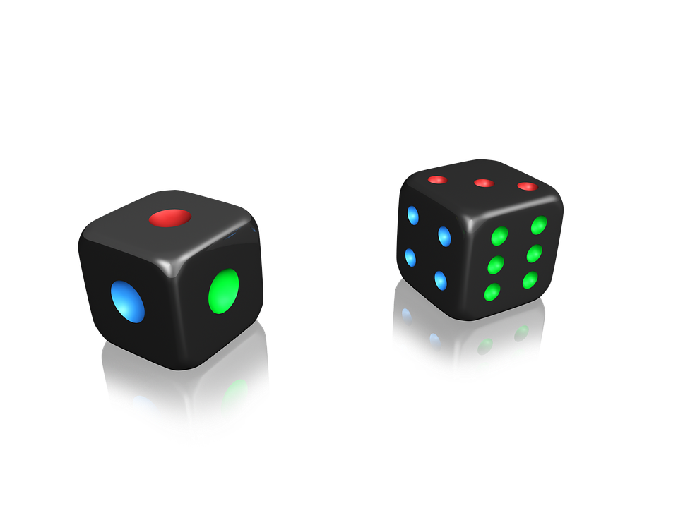

# Teams Roulette Bot



A Discord bot for create random teams based in a names list.

## Commands

### `/lista`

Get a random sort list names

### `/parejas`

Get a random couples list

### `/tercias`

Get a random threesomes list

## data.json

This bot needs a file named `data.json`. The file's structure are:

```json
{
	"names": [
		"John Doe",
		"Marie Sue",
		"Jerry Stue"
	],
	"token": "my.Awesome.Discord.Token"
}
```


